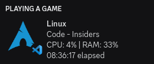

# rpcfetch

[](https://grial.tech/discord)

## Description

rpcfetch is a Discord Rich Presence application written in C, that fetches and displays your system statistics. It's lightweight, user friendly and customizable. This is the continuation of [RPC++](https://github.com/grialion/rpcpp).

## Features

You can get the following on your Discord presence:

- OS, distribution info
- real-time system resource usage info
- focused window info
- window manager info
- system uptime



## Configuration

The config file is a simple `key=value` file type with comments (#).

See [examples/rpcfetch.cfg](./examples/rpcfetch.cfg) for more info.

1. A custom configuration path can be passed as a command line argument: `--config=<path_to_config>`
2. If it's not provided as an argument, the application will try to parse the `~/.config/rpcfetch/rpcfetch.cfg` file.
3. If none of those succeed, the application will try to parse the `/etc/rpcfetch/rpcfetch.cfg` file.

> To list the command line arguments, use:
> `rpcfetch --help`

## My application / distribution is missing! Could you add it?

Of course!

Check out [rpcfetch/resources](https://github.com/rpcfetch/resources) and feel free to open an issue about the desired images! If you feel brave enough, you could even make a pull request there. You may also want to check out [#contributing](#contributing). You may also want to join the [Discord server](https://grial.tech/discord).

## Building manually

### Requirements

- `wget` and `unzip` - required by the [setup script](./setup.sh)
- `PCRE2` - required for regex support
- `curl` - optional, used for updater
- `gcc` and `GNU Make` - required for building the application

### Installing the requirements

#### Arch based systems:

```sh
pacman -S wget unzip pcre2 curl
```

#### Debian based systems:

```sh
apt install wget unzip libpcre2-dev libcurl4-openssl-dev
```

## Prerequisites

Set up Discord Game SDK using:

```sh
./setup.sh
```

## Building

To build rpcfetch use:

```sh
make
```
> [!NOTE]
> To build rpcfetch without the updater functionality, use `make offline`

## Installation

Install rpcfetch and the Discord Game SDK library using:

```sh
make install
```
> [!NOTE]
> This will also install the Discord Game SDK library.

## Other awesome Discord Rich Presence alternatives

- [trickybestia/linux-discord-rich-presence](https://github.com/trickybestia/linux-discord-rich-presence) - Customizable Discord Rich Presence client for Linux - Rust. What else can I say about it?
- [fetchcord/FetchCord](https://github.com/fetchcord/FetchCord) - FetchCord grabs your OS info and displays it as Discord Rich Presence - Same idea, unmaintained.

## Contributing

If you decide to contribute to the project, you will need to have a basic knowledge of C. Please only add features that are useful to everyone, not just yourself.

To add more images, see [rpcfetch/resources](https://github.com/rpcfetch/resources).

## Motivation

I always thought it would be cool to share your system info on Discord. That is why I created [RPC++](https://github.com/grialion/rpcpp), but I lost motivation and the project died. I wanted to create something that was more user-centric and available to everyone. This project serves that purpose.

The [rpcfetch/resources](https://github.com/rpcfetch/resources) is the heart of this project. Feel free to contribute, add or request the icons you'd like to see!

## Licenses

This project uses the following libraries:
- [PCRE2](https://github.com/PCRE2Project/pcre2): BSD 3-Clause "New" or "Revised" License - PCRE2 makes parsing regular expressions possible
- [curl](https://github.com/curl/curl): MIT/X license derivative - curl makes HTTP requests (the updater module) possible
- [cJSON](https://github.com/DaveGamble/cJSON): MIT License - cJSON makes parsing JSON data possible
- [semver.c](https://github.com/h2non/semver.c): MIT License - semver.c helps with parsing semantic versions

## License

MIT License
